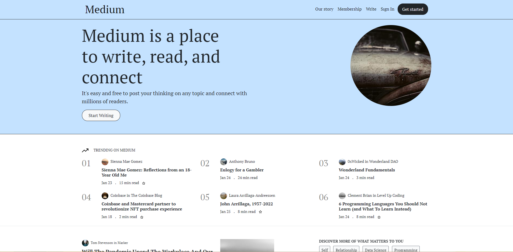
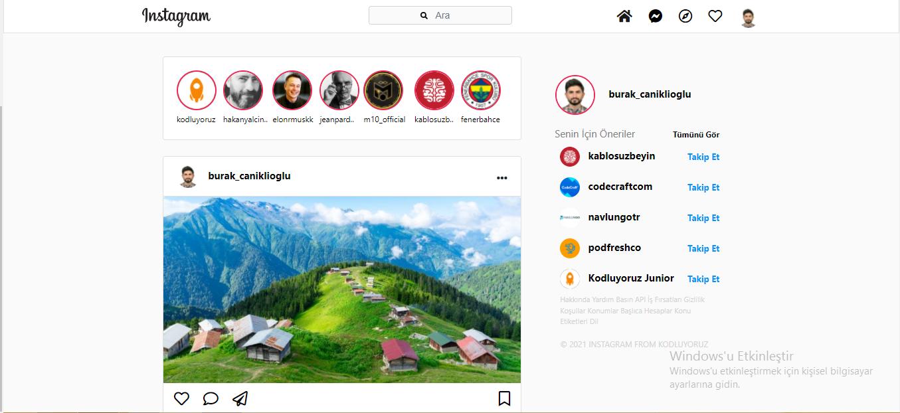

# Static-Projects-with-SASS-and-Bootstrap5

- [Medium Clone](#medium-clone)
  - In this study, I tried to create a clone of the Medium website with bootstrap5.

- [Responsive Website](#responsive-website)
  - It is a landing page designed for a software company and made available on all devices with a responsive design.

- [Linkedin Clone](#linkedin-clone)
  - In this study, I tried to create a clone of the Linkedin website with bootstrap5.

- [Instagram Clone](#instagram-clone)
  - I tried to create a clone of the Instagram website with bootstrap5.
 
 

## Medium Clone

 
 

## Responsive Website

 
 

## Linkedin Clone

 
 

## Instagram Clone

